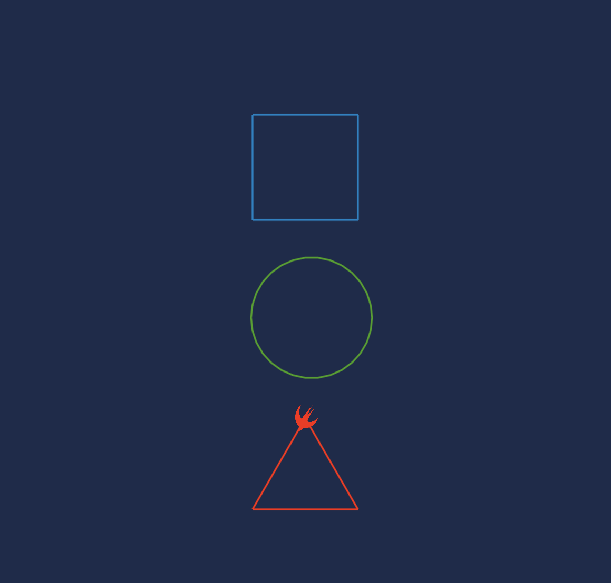
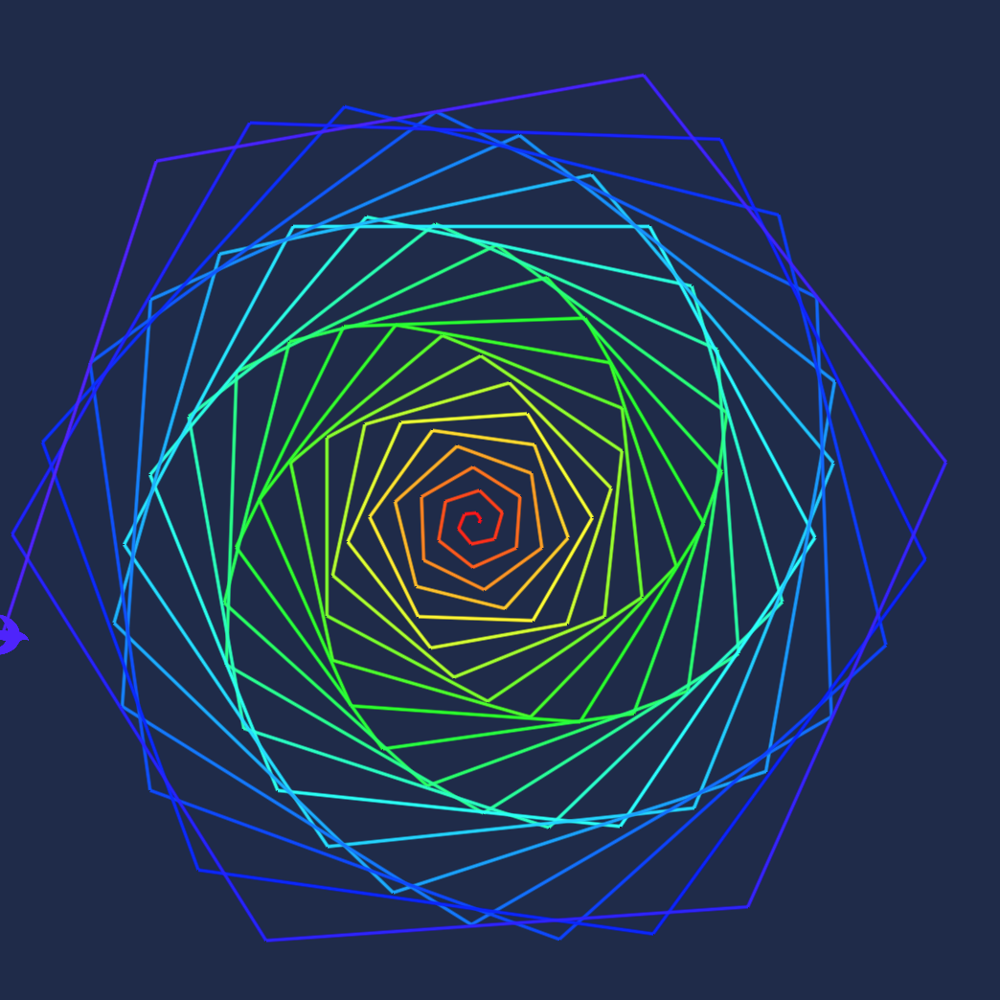

# WWDC19Scholarship
My accepted WWDC scholarship playground for 2019.

I made a playground using the SpriteKit, SceneKit and ARKit technologies to make a drawing bird. The bird can be moved around by using commands like `bird.forward(length: )` or `bird.left(angle: )`. In the playground I also made some demonstrations of what you can do with those commands. Like drawing simple shapes, making amazing spirals or drawing text. 

Simple Shapes
 

Spiral
 

Drawing Text
 

